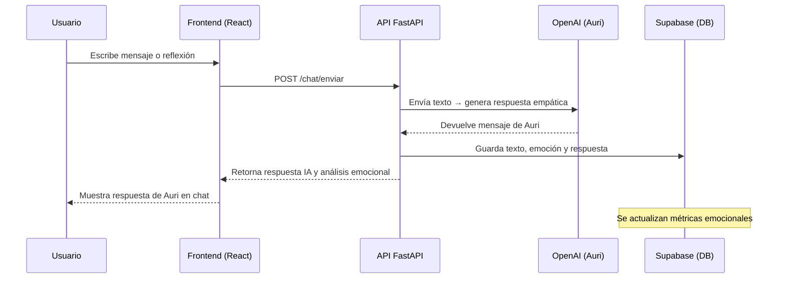

# 🧠 MiDiarioIA - Backend (FastAPI + Supabase + OpenAI)

> Sistema de diario emocional inteligente impulsado por IA empática (“Auri”)  
> Desarrollado para el desafío **28 Hrs UPC - IA Aplicada al Bienestar Emocional**

---

## 🚀 Descripción General

**MiDiarioIA** es una API backend que permite registrar, analizar y acompañar las emociones de los usuarios mediante una IA empática llamada **Auri**.  
Auri conversa con las personas, analiza el tono emocional de sus textos, guarda reflexiones diarias y genera métricas de bienestar a lo largo del tiempo.

La arquitectura está basada en **FastAPI**, **Supabase (PostgreSQL + REST)** y **OpenAI GPT-4o mini**.

---

## 🏗️ Arquitectura del Proyecto

```

📦 backend/
│   ├── main.py
│   ├── .env
│   ├── requirements.txt
│   │
│   └── app/
│       ├── agents/
│       │   └── openai_agent.py
│       │
│       ├── core/
│       │   ├── config.py
│       │   ├── supabase_client.py
│       │   ├── db_functions.py
│       │   └── metricas.py
│       │
│       ├── routes/
│       │   ├── chat_routes.py
│       │   └── diario_routes.py
│       │
│       └── schemas/
│           └── mensaje_schema.py

````

### 🔹 Componentes

| Módulo | Descripción |
|--------|--------------|
| **FastAPI** | Framework principal para la API REST. |
| **Supabase** | Base de datos PostgreSQL + API REST. |
| **OpenAI API** | Modelo `gpt-4o-mini` usado para análisis y respuestas empáticas. |
| **python-dotenv** | Carga de variables de entorno desde `.env`. |

---

## ⚙️ Instalación

### 1️⃣ Clonar el repositorio
```bash
git clone https://github.com/tuusuario/midiarioia-backend.git
cd midiarioia-backend
````

### 2️⃣ Crear entorno virtual

```bash
python -m venv .venv
source .venv/Scripts/activate  # Windows
# o
source .venv/bin/activate      # Linux/Mac
```

### 3️⃣ Instalar dependencias

```bash
pip install -r requirements.txt
```

### 4️⃣ Configurar variables de entorno `.env`

Crea el archivo `.env` en la raíz del proyecto:

```
OPENAI_API_KEY=sk-proj-XXXXXXX
SUPABASE_URL=https://<tu-proyecto>.supabase.co
SUPABASE_KEY=<service_role_key_de_supabase>
```

### 5️⃣ Ejecutar el servidor

```bash
uvicorn main:app --reload
```

Abre tu navegador en
👉 **[http://127.0.0.1:8000/docs](http://127.0.0.1:8000/docs)**

---

## 🧠 Flujo General del Sistema (Auri)



---

## 🗃️ Base de Datos (Supabase / PostgreSQL)

### Tablas principales

* **usuarios** → Datos de usuario (id, nombre, email).
* **mensajes_chat** → Historial de chat usuario ↔ Auri.
* **entradas_diario** → Reflexiones diarias y resúmenes.
* **metricas_emocionales** → Agregaciones semanales/mensuales.
* **actividades_bienestar** → Recomendaciones y hábitos sugeridos.
* **feedback_usuario** → Valoraciones sobre respuestas de Auri.

Incluye vistas predefinidas:

* `vista_resumen_diario`
* `vista_historial_completo`

---

## 📡 Endpoints Principales

### 💬 `/chat`

| Método | Ruta                           | Descripción                                                     |
| ------ | ------------------------------ | --------------------------------------------------------------- |
| `POST` | `/chat/enviar`                 | Envía un mensaje a Auri → guarda y devuelve análisis emocional. |
| `GET`  | `/chat/historial/{usuario_id}` | Devuelve todos los mensajes del usuario.                        |

#### Ejemplo de petición:

```json
POST /chat/enviar
{
  "usuario_id": "2c49c4ee-6b09-49b1-bc2e-7a01a1341a9f",
  "texto": "Hoy me sentí más tranquilo que ayer, aunque algo cansado."
}
```

#### Respuesta:

```json
{
  "usuario_id": "2c49c4ee-6b09-49b1-bc2e-7a01a1341a9f",
  "texto_usuario": "Hoy me sentí más tranquilo...",
  "respuesta_auri": "Me alegra que encuentres un poco más de calma...",
  "emocion_detectada": "calma",
  "categoria": "positiva",
  "puntaje": 0.72
}
```

---

### 📓 `/diario`

| Método | Ruta                            | Descripción                                                   |
| ------ | ------------------------------- | ------------------------------------------------------------- |
| `POST` | `/diario/entrada`               | Crea una nueva entrada de diario y la analiza emocionalmente. |
| `GET`  | `/diario/entradas/{usuario_id}` | Devuelve todas las reflexiones del usuario.                   |
| `GET`  | `/diario/resumen/{usuario_id}`  | Muestra el último resumen emocional guardado.                 |
| `POST` | `/diario/resumen-semanal`       | Genera resumen global a partir de los mensajes de la semana.  |

#### Ejemplo de respuesta `/diario/resumen/{usuario_id}`:

```json
{
  "usuario_id": "2c49c4ee-6b09-49b1-bc2e-7a01a1341a9f",
  "periodo": "2025-W45",
  "emociones_predominantes": {"positiva": 0.6, "neutra": 0.3, "negativa": 0.1},
  "promedio_sentimiento": 0.73,
  "resumen_periodo": "Tu estado emocional se mantiene equilibrado...",
  "recomendacion": "Sigue escribiendo para fortalecer tu autoconocimiento.",
  "actualizado_en": "2025-11-08T12:30:22Z"
}
```

---

## 🧮 Métricas Automáticas

Cada vez que el usuario guarda una entrada o conversa con Auri:

1. Se analiza la emoción con **GPT-4o-mini**.
2. Se guarda el puntaje y la categoría.
3. Se recalculan métricas agregadas por semana/mes.

### Generación manual de métricas

```python
from app.core.metricas import generar_metricas_emocionales
generar_metricas_emocionales(usuario_id="UUID")
```

---

## 🧠 Auri (Agente Empático)

Prompt base utilizado:

```
Eres Auri, una IA empática que acompaña a las personas a reflexionar sobre sus emociones.
Usa un tono cálido, humano y tranquilizador. No das diagnósticos médicos.
Si detectas una emoción, nómbrala suavemente y valida lo que la persona siente.
Ofrece siempre una pregunta abierta que invite a reflexionar o expresarse más.
```

---

## 💾 Dependencias

```txt
fastapi
uvicorn
openai
supabase
python-dotenv
sqlalchemy
psycopg2-binary
```

---

## 🧩 Próximas Extensiones

* 🔒 Autenticación Supabase Auth (Google / email).
* 📈 Dashboard emocional en el frontend (gráficos Recharts).
* 🧘 Sugerencias dinámicas de bienestar (actividades diarias).
* 📅 Recordatorios automáticos para escribir en el diario.
* 💬 Entrenamiento personalizado de Auri según historial.

---

## 🏁 Autores y Equipo

**Equipo:** *CardioSense / MiDiarioIA*
**Backend y Arquitectura IA:** César Rojas Ramos
**Frontend (React + UI):** Mauricio [@tu_github]
**Año:** 2025
**Institución:** Duoc UC / UPC Perú – Desafío 28 hrs

---

> 💡 *“MiDiarioIA convierte tus palabras en conocimiento emocional.”*